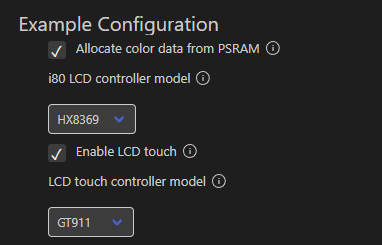
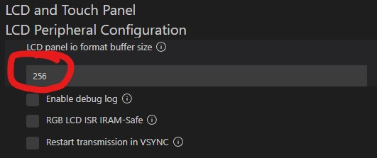
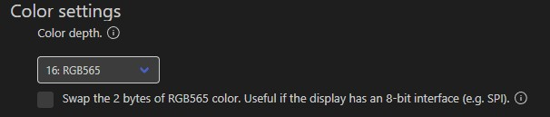
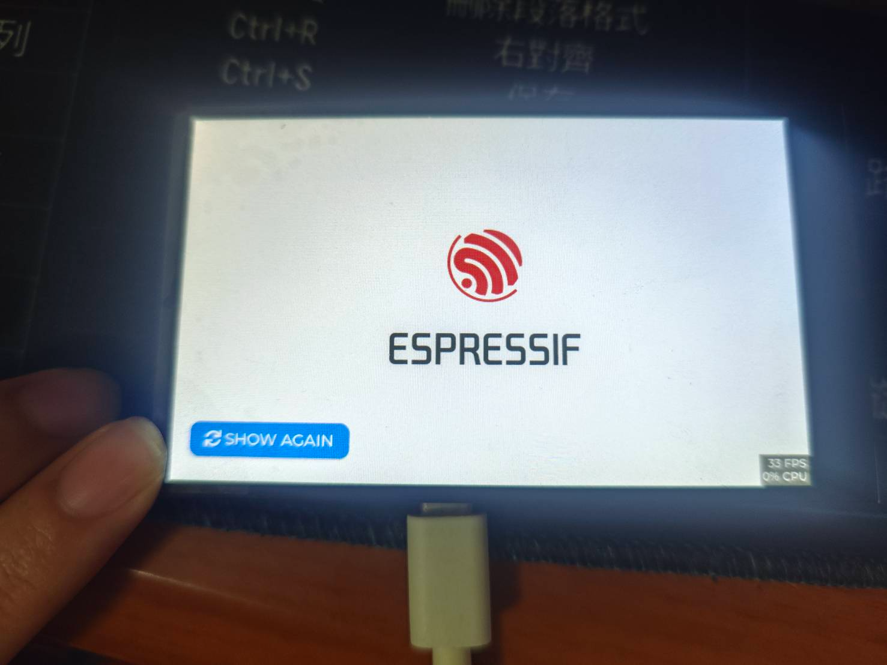

# fork from LiJingjie05/lcd_hx8369_lvgl "这是一个关于hx8369在esp-idf5.0.7上的例程。"


### 淘寶當時隨便買的螢幕，賣家只給了根本無法下載的百度404網盤，只拿到原理圖，一個一個pin define慢慢tune到成功，給買這家螢幕的人做啟動的參考。

# !!!此代碼僅提供啟動使用，不具備任何支持服務，如果要購買請自行評估。!!!
賣場連結: https://item.taobao.com/item.htm?_u=r2giua332303&id=706559194635&sku_properties=-3%3A-5%3B-7%3A-9

賣家硬體參考:
https://oshwhub.com/fanhuacloud/fpc4301ms
# !!!此代碼僅提供啟動使用，不具備任何支持服務，如果要購買請自行評估。!!!

## 注意事項:
esp-idf 版本使用5.0.7。 
測試 5.2.3、5.3.2 樂鑫調整了 buffer的錯誤輸出，導致例程無法正常運行，也找不到要調整的關鍵參數，最後發現問題出在lcd buffer config 這個選項上，其原因是 hx8369啟動```static esp_err_t panel_hx8369_init(esp_lcd_panel_t *panel)```需要192的buffer，但樂鑫預設是32bytes，將buffer size調大到192，即可正常運行。 
## 調整了以下參數:
- esp-idf sdk config: Example Configuration.
   
-  lcd buffer config
   
-  Disable_lvgl_16to8_config
   

- 調整I2C腳位:
```
#if CONFIG_EXAMPLE_LCD_TOUCH_ENABLED
#define EXAMPLE_I2C_NUM                 0   // I2C number
#define EXAMPLE_I2C_SCL                 38
#define EXAMPLE_I2C_SDA                 39
#endif
```
- 移除lvgl顏色反轉
```
// esp_lcd_panel_invert_color(panel_handle, true);
```
- 調整touch_panel設定
```    
esp_lcd_touch_config_t tp_cfg = {
        .x_max = EXAMPLE_LCD_V_RES,
        .y_max = EXAMPLE_LCD_H_RES,
        .rst_gpio_num = 5,
        .int_gpio_num = 4,
        .flags = {
            .swap_xy = 1,
            .mirror_x = 0,
            .mirror_y = 1,
        },
    };
```

## 啟動畫面

